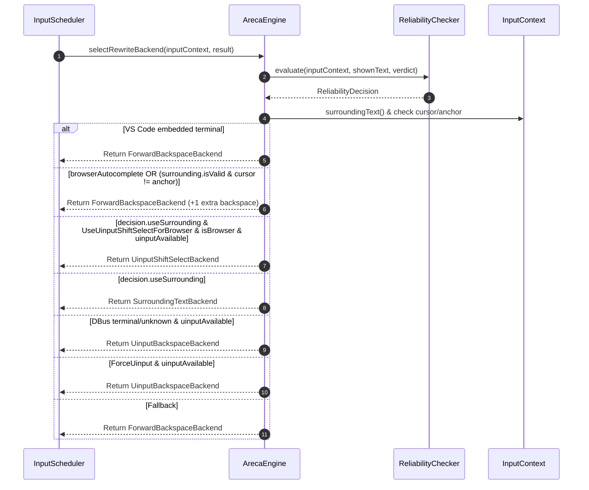
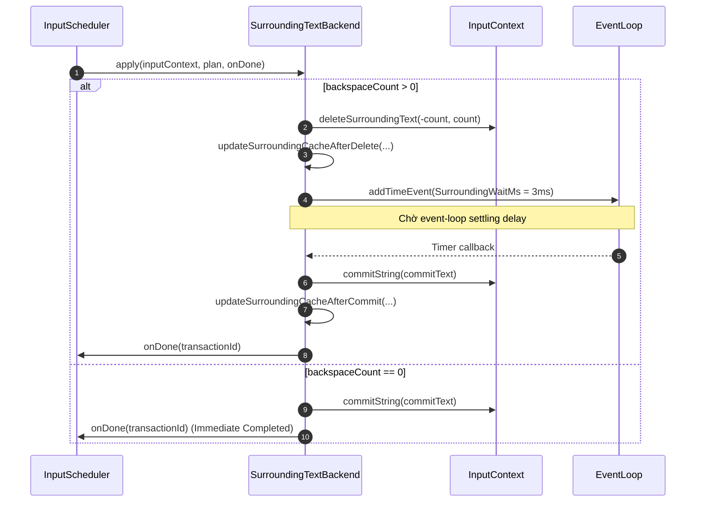
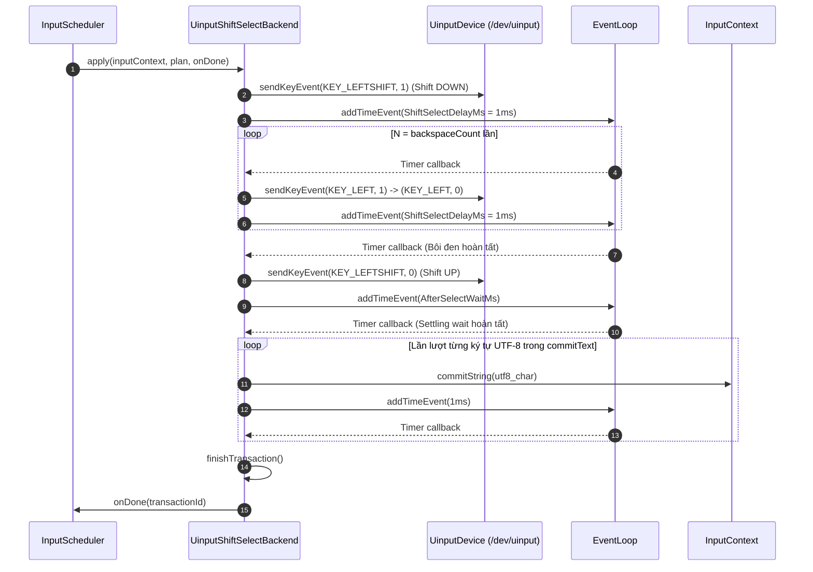
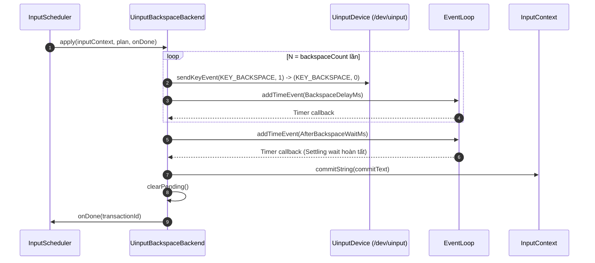
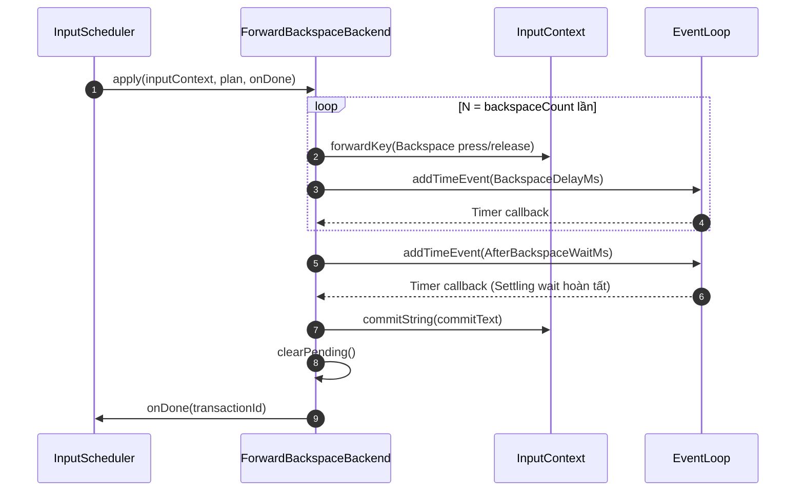
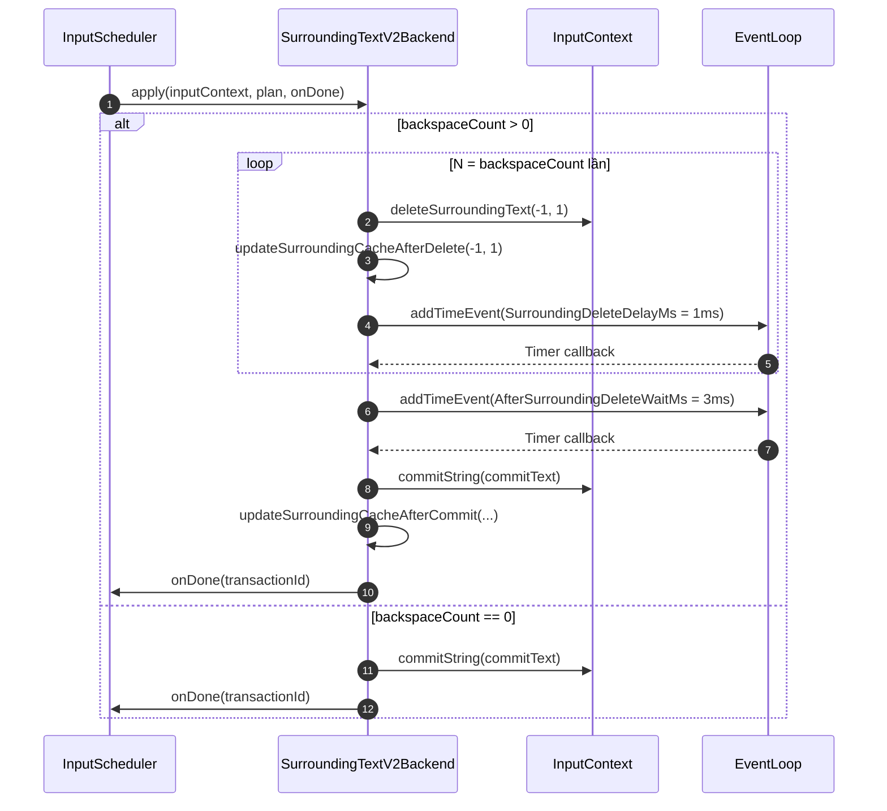

# Kiến trúc Areca IME

Tài liệu này mô tả pipeline hiện tại của Areca. Mục tiêu thiết kế là giữ đúng
thứ tự input, tránh rewrite song song và cô lập engine tiếng Việt khỏi chi tiết
Wayland và Fcitx5.

> **Xem thêm:**
> - [Giao diện HTML & Sequence Diagram tương tác](../website/architecture.html)
> - [Đặc tả kỹ thuật & Sequence Diagram (Markdown)](ARECA_ARCHITECTURE_SPECIFICATION.md)

## Thành phần

| Thành phần | Trách nhiệm |
| --- | --- |
| `ArecaEngine` | Nhận event từ Fcitx5, dispatch sang mode đang chọn và giữ cache verdict backend cho context hiện tại. |
| `InputModeHandler` | Interface lifecycle/KeyEvent không chứa state; engine gọi handler đang active qua interface này. |
| `RewriteInputState` | Bamboo, auto-capitalization và reset timer riêng của Rewrite. |
| `PreeditInputState` | Bamboo, composition, auto-capitalization và reset timer riêng của Preedit. |
| `RewriteModeHandler` | Toàn bộ policy KeyEvent/reset của Rewrite; enqueue trực tiếp vào `InputScheduler`. |
| `PreeditModeHandler` | Xử lý Bamboo đồng bộ và quản lý UI preedit; không gọi scheduler hay rewrite backend. |
| `RedirectModeHandler` | Forward KeyEvent nguyên bản như password field; không có Bamboo, queue, timer hay mutable state. |
| `KeyQueue` | FIFO chứa key gốc, Unicode codepoint, UTF-8, sequence và reference tới input context. |
| `InputScheduler` | FIFO single-flight, backend selection, transaction barrier và timer riêng sau commit. |
| `BambooEngineAdapter` | Bridge C++/Go gọi trực tiếp `bamboo-core` và biến chuỗi kết quả thành `BambooResult`. |
| `ReliabilityChecker` | Probe SurroundingText lần đầu và cache verdict theo input context. |
| `RewriteBackend` | Interface chung cho thao tác apply một `RewritePlan`. |
| `SurroundingTextBackend` | Gọi `deleteSurroundingText()` và `commitString()`. |
| `ForwardBackspaceBackend` | Phát tuần tự Backspace press/release bằng `forwardKey()`, chờ settling delay rồi commit text và hoàn tất transaction. |
| `UinputBackspaceBackend` | Gửi phím `KEY_BACKSPACE` qua `/dev/uinput` cho terminal DBus và ứng dụng không xác định. Terminal nhúng trong VS Code dùng `ForwardBackspaceBackend`. |
| `UinputShiftSelectBackend` | Gửi `Shift down`, `Left` × N, `Shift up` qua `/dev/uinput` để bôi đen, sau đó commit từng ký tự mới cho các ứng dụng trình duyệt web. |

## Phân tách cấu hình

Cấu hình chính ở `conf/areca.conf` chỉ chứa các tuỳ chọn dùng thường xuyên.
Timing nằm trong sub-config **Cấu hình nâng cao** tại
`conf/areca-advanced.conf`, dùng cùng cơ chế panel con với trình sửa macro.
Các field timing cũ trong `areca.conf` được giữ ẩn để migrate cấu hình;
file nâng cao, nếu có, luôn được load sau và được ưu tiên.
`PreciseTiming=True` đặt accuracy của timer Backspace và post-commit thành
`1µs`; khi tắt, accuracy bằng `0` và event-loop backend được phép coalesce timer.

## Vòng đời text key trong Rewrite

1. Fcitx5 gọi `ArecaEngine::keyEvent()`.
2. Release event bình thường không bị giữ lại. Modifier-only key được bỏ qua.
3. Password input được forward thẳng và state cũ của context bị xoá.
4. Special key đi theo policy riêng; text key hợp lệ được `filterAndAccept()`.
5. Areca huỷ delayed reset đang chờ rồi đẩy key vào `KeyQueue`.
6. Nếu pipeline đang rảnh, scheduler pop ngay đúng một key và gọi Bamboo.
7. Scheduler apply `BambooResult`; trong lúc apply/commit/rewrite, key mới chỉ
   được nối vào cuối FIFO.
8. Forward backend phát đúng số Backspace trong plan rồi chờ
   `AfterBackspaceWaitMs` trước khi commit; frontend `wayland` dùng riêng
   `WaylandAfterBackspaceWaitMs`, mặc định 3 ms.
9. Sau khi apply hoàn tất và qua `PostCommitDelayMs`, scheduler mới pump đúng
   một key tiếp theo.

Scheduler không dùng timer trước Bamboo và không dùng vòng lặp hút hết queue.
Key đầu được xử lý inline trong callback Fcitx; queue chỉ giữ các key đến trong
lúc pipeline đang bận. `PostCommitDelayMs` bắt đầu sau khi backend đã commit và
báo hoàn tất.

## BambooResult và diff

Go bridge tạo một `bamboo.IEngine` trực tiếp bằng:

```go
bamboo.NewEngine(method, bamboo.EstdFlags)
```

`BambooEngineAdapter` giữ chuỗi mà nó tin rằng đang hiển thị. Sau mỗi key,
Bamboo trả chuỗi đã xử lý mới; adapter tìm common prefix UTF-8 và tạo:

```text
currentText  chuỗi trước key
newText      chuỗi Bamboo mới
deleteCount  số Unicode character ở suffix cũ cần xoá
commitText   suffix mới cần chèn
```

Ví dụ Telex:

```text
currentText = "a"
key         = "w"
newText     = "ă"
deleteCount = 1
commitText  = "ă"
```

Ký tự Bamboo không xử lý được được xem như word boundary. Hành vi tại boundary
phụ thuộc vào `SpellcheckMode`:

- `"Không kiểm tra (Tắt)"`: không kiểm tra, commit từ nguyên trạng.
- `"Khôi phục từ sau khi gõ xong"`: gọi `IsValid(true)` trước khi reset. Từ có
  ký tự tiếng Việt nhưng cấu trúc âm tiết không hợp lệ được
  `RestoreLastWord(false)` về chuỗi phím Latin ban đầu; adapter tạo delta
  rewrite cho phần restore rồi nối boundary. Từ hợp lệ chỉ commit boundary
  như bình thường.
- `"Khôi phục từ ngay trong lúc gõ"`: như mức trên và ngoài ra khi xử
  lý từng ký tự trung gian, bridge truyền `spellCheck=1` vào
  `ArecaBambooProcess` để Bamboo kiểm tra và rollback ngay trong lúc gõ.

Tính năng này dùng luật có sẵn của `bamboo-core`, chưa dùng dictionary ngoài.

Khi tạo engine, bridge ánh xạ `ModernStyle=True` sang cách đặt dấu `oà/uý` và
`ModernStyle=False` sang `òa/úy`. Việc ánh xạ ngược với tên flag nội bộ
`EstdToneStyle` là có chủ ý để tên option mô tả trực tiếp chuỗi đầu ra.

Bridge cũng xuất danh sách input method và charset trực tiếp từ `bamboo-core`
cho giao diện cấu hình. Adapter giữ Bamboo state ở Unicode nội bộ, nhưng encode
chuỗi mới bằng `OutputCharset` trước khi tính common prefix. Vì vậy
`currentText`, `newText`, `deleteCount` và `commitText` luôn mô tả đúng chuỗi
thực tế đã commit vào ứng dụng, kể cả `Unicode tổ hợp`, VNI Windows hoặc VIQR.

## Macro expansion

Macro table là sub-config riêng gồm các cặp `Key/Value`. Khi xử lý một word
boundary, bridge lấy word hiện tại ở `PunctuationMode`, lookup key không phân
biệt hoa/thường và expand trước spell-check. Nếu `CapitalizeMacro` bật, key viết
thường tạo replacement viết thường, key toàn chữ hoa tạo replacement toàn chữ
hoa, còn kiểu mixed-case giữ nguyên value cấu hình. Adapter reset Bamboo sau
match, nối boundary, encode theo charset rồi tính delta rewrite. Vì thế macro
không có đường commit đặc biệt và vẫn tuân thủ mọi queue/pending invariant.

Nếu `AutoCapitalizeAfterPunctuation` bật, state theo từng input context theo dõi
`.`, `!`, `?` rồi khoảng trắng. Chữ ASCII thường kế tiếp được đổi thành keysym
hoa trước khi enqueue và trước khi Bamboo xử lý. Phím đã đổi hoa vẫn đi qua
scheduler như mọi text key khác và mang cờ buộc `commitString`, vì replay phím
vật lý không có Shift có thể vẫn tạo chữ thường. `Enter`, reset, Backspace, di
chuyển con trỏ và shortcut sẽ xoá trạng thái chờ để tránh viết hoa nhầm.
git
Sau khi finalize một từ, adapter giữ composition Bamboo của từ đó và đếm các
dấu cách/dấu câu đã commit phía sau. Backspace đi ngược qua các boundary này;
khi boundary cuối bị xoá, composition vừa finalize được phục hồi để lần gõ kế
tiếp có thể sửa dấu hoặc Backspace tiếp tục xoá từ. Composition chỉ bị bỏ khi
người dùng bắt đầu một từ mới hoặc khi protected reset thực sự chạy.

## Backend selection

Khi `deleteCount == 0`:

- Nếu `commitText` giống text của phím gốc, scheduler dùng `commitString()`.
  Phím gốc đã bị accept trước khi vào queue nên không replay bất đồng bộ bằng
  `forwardKey()`; GNOME
  IBus Wayland có thể không chuyển loại forwarded key này tới text-input client.
- Nếu Bamboo đã biến đổi output dù không cần xoá, scheduler commit
  `commitText`. Trường hợp điển hình là dấu của `Unicode tổ hợp`.
- Cả hai nhánh vẫn đi qua queue và settling barrier.

Khi `deleteCount > 0`:

1. `ReliabilityChecker` đánh giá input context.
2. Checker lọc program trước. Chỉ khi program thuộc họ VS Code, là IDE/code
   editor/developer tool, hoặc là terminal Linux đã biết thì checker mới đọc và
   so sánh capability mask. Nếu mask chính xác là `0x72`, checker cache
   `forceForwardBackspace` rồi chọn `ForwardBackspaceBackend`. Các ứng dụng
   ngoài allowlist không được xét rule theo mask; verdict unreliable vốn đã
   chọn forward backend theo policy mặc định.
   Program name rỗng cũng nằm ngoài allowlist và không được fallback theo
   frontend, vì không đủ dữ liệu để ép an toàn.
3. Nếu `UseUinputShiftSelectForBrowser` bật, ứng dụng là trình duyệt web và `/dev/uinput` khả dụng: chọn `UinputShiftSelectBackend`. Tuy nhiên nếu phát hiện đang có bôi đen sẵn (`cursor != anchor`) hoặc có `browserAutocomplete`, hệ thống hủy chọn uinput-shift-select và fallback về `ForwardBackspaceBackend` (+1 phím Backspace phụ) để đảm bảo an toàn.
4. Verdict reliable còn lại chọn `SurroundingTextBackend`.
5. Verdict unreliable chọn `ForwardBackspaceBackend`.

## Sơ đồ Sequence chi tiết các Backend và Selection Logic

### 1. Sơ đồ quyết định lựa chọn Backend (`selectRewriteBackend`)



### 2. Sơ đồ luồng `SurroundingTextBackend`



### 3. Sơ đồ luồng `UinputShiftSelectBackend`



### 4. Sơ đồ luồng `UinputBackspaceBackend`



### 5. Sơ đồ luồng `ForwardBackspaceBackend`



## Preedit mode

`PresentationMode=Preedit` không dùng `InputScheduler`, `RewriteBackend`,
`ReliabilityChecker`, SurroundingText hay forward-Backspace. Nó có riêng:

- `PreeditInputState` cho từng input context;
- một `BambooEngineAdapter` riêng;
- xử lý `KeyEvent` đồng bộ như frontend Preedit của Bamboo;
- composition, sentence-capitalization và delayed-reset riêng.

Text key được xử lý tuần tự rồi hiển thị bằng client preedit nếu app khai báo
`CapabilityFlag::Preedit`; nếu không thì dùng server-side preedit của Fcitx.
Backspace chỉ sửa composition khi composition còn tồn tại. Space/dấu câu chạy
macro và spell-check qua Bamboo rồi commit toàn bộ từ. Enter, Tab, Delete và
phím di chuyển commit composition trước khi được forward. Escape và shortcut
cũng commit composition trước, sau đó Fcitx forward nguyên `KeyEvent` gốc.

Hai mode xử lý tiếng Việt chỉ dùng chung cấu hình bất biến và lớp adapter; chúng
không dùng chung engine instance hoặc mutable input state. `RedirectModeHandler`
không có engine/state. `ArecaEngine` chỉ dispatch theo mode global, và reset
cả Rewrite lẫn Preedit khi người dùng đổi mode.

Hotkey `SwitchModeKey` (mặc định `Alt+Space`) được bắt trước bước dispatch vì nó
thay đổi chính handler đích. Areca hủy state/queue của hai handler có state,
quay vòng `Rewrite → Preedit → Redirect → Rewrite`, lưu mode global và gọi popup
thông tin Fcitx5. Hotkey không đổi mode giữa transaction rewrite đang pending;
password context tiếp tục nhận phím gốc như bình thường.

## Redirect mode

`Redirect` chỉ được bật bằng `PresentationMode` global; Areca không tự đổi mode
theo input context. `RedirectModeHandler` không xử lý nội dung: press event gọi
`KeyEvent::forward()`, release event được để nguyên cho Fcitx chuyển tiếp.

## Reliability lifetime

Probe chỉ diễn ra khi rewrite đầu tiên cần delete:

- App phải quảng bá capability `SurroundingText`.
- Snapshot phải valid.
- Từ ngay trước cursor phải có suffix không rỗng khớp với `currentText`.

Kết quả được cache ở cấp `ArecaEngine`, cùng UUID của context hiện tại. Bình
thường lifecycle sẽ xoá verdict để rewrite sau đánh giá lại. Backspace, Ctrl+A
và phím di chuyển/chọn text bảo vệ riêng verdict trong 1 giây; lifecycle và reset
state nhập vẫn chạy bình thường. UUID thay đổi luôn làm cache được tạo lại cho
context mới.

Snapshot browser autocomplete không được dùng làm first probe; checker giữ
`known=false` để lần rewrite bình thường sau mới quyết định reliability.

## Forward-Backspace single-flight state machine

```text
Idle
 │ apply(plan)
 ▼
Forward Backspace đầu tiên
 │ còn Backspace
 ├──► timer(BackspaceDelayMs) ──► forward Backspace kế tiếp
 │ hết Backspace
 └──► timer(AfterBackspaceWaitMs)
                │
 ▼
Commit text → clear pending → post-commit timer → process next key
```

Trong `Pending`, `processing_` vẫn là true nên scheduler không lấy key tiếp.
Key mới chỉ được append vào queue. Backend giữ đúng một transaction và gọi
completion callback đúng một lần sau commit.

## Surrounding cache

Areca không tự chỉnh object `surroundingText()` mà Fcitx đang cache sau delete,
selection delete hoặc commit. Addon chờ frontend gửi snapshot mới từ ứng dụng.

## Reset barrier

`ArecaEngine::reset()` chỉ arm timer của mode đang hoạt động, không reset ngay.
Reset thật xảy ra sau `ResetDelayMs` nếu không có input mới. Rewrite pending
làm timer Rewrite được arm lại. Preedit không có processing queue; phím
mới chỉ huỷ delayed-reset của chính nó. Hai timer và hai composition không tham
chiếu lẫn nhau.

Special key mà user chủ động gõ vẫn có policy tức thời:

- Cursor, Tab, Escape và Ctrl/Alt/Super/Meta combination: reset Bamboo rồi
  forward.
- Return/KP Enter: reset Bamboo rồi forward nguyên event.
- Backspace: gọi `RemoveLastChar(true)` để đồng bộ Bamboo rồi forward.
- Delete: forward mà không thay Bamboo history.

## Hướng mở rộng

### 1. Thêm Mode SurroundingOnly
Policy `SurroundingOnly` sau này có thể được thêm như một rewrite mode thứ ba,
với state và scheduler riêng hoặc backend selector luôn chọn
`SurroundingTextBackend`. Nó không cần thay đổi `PreeditModeHandler`.

### 2. SurroundingTextV2Backend: Xóa từng ký tự thay vì xóa toàn bộ

#### Hiện trạng của v1
`SurroundingTextBackend` v1 thực hiện xóa `N` ký tự trong một câu lệnh duy nhất:
```cpp
inputContext.deleteSurroundingText(-static_cast<int>(plan.backspaceCount), plan.backspaceCount);
```

#### Hạn chế của cơ chế xóa gộp
- **Lỗi tính offset của ứng dụng**: Một số trình duyệt như Firefox Gecko trên Wayland hoặc các bộ soạn thảo Web như Monaco Editor, CodeMirror xử lý câu lệnh xóa gộp `-N` ký tự không ổn định khi phía sau con trỏ đang có các ký tự đặc biệt như dấu ngoặc `}}` hoặc thẻ HTML.
- **Rủi ro lệch vị trí xóa**: Việc xóa gộp một lượt có thể dẫn tới hiện tượng trình duyệt xóa thiếu ký tự hoặc tính nhầm độ dài ký tự UTF-8 multibyte.

#### Cơ chế của SurroundingTextV2Backend
`SurroundingTextV2Backend` sử dụng cơ chế vòng lặp xóa từng ký tự qua timer event loop:
1. Mỗi nhịp timer `SurroundingDeleteDelayMs`, phát lệnh xóa 1 ký tự trước con trỏ: `deleteSurroundingText(-1, 1)`.
2. Lặp lại cho tới khi xóa đủ số ký tự cần thiết `backspaceCount`.
3. Chờ hết thời gian settling delay `AfterSurroundingDeleteWaitMs`, sau đó mới thực hiện `commitString(commitText)`.
4. Có thể kích hoạt thông qua tùy chọn `UseSurroundingV2ForBrowser` khi ứng dụng là trình duyệt.

#### Sơ đồ Sequence của SurroundingTextV2Backend

