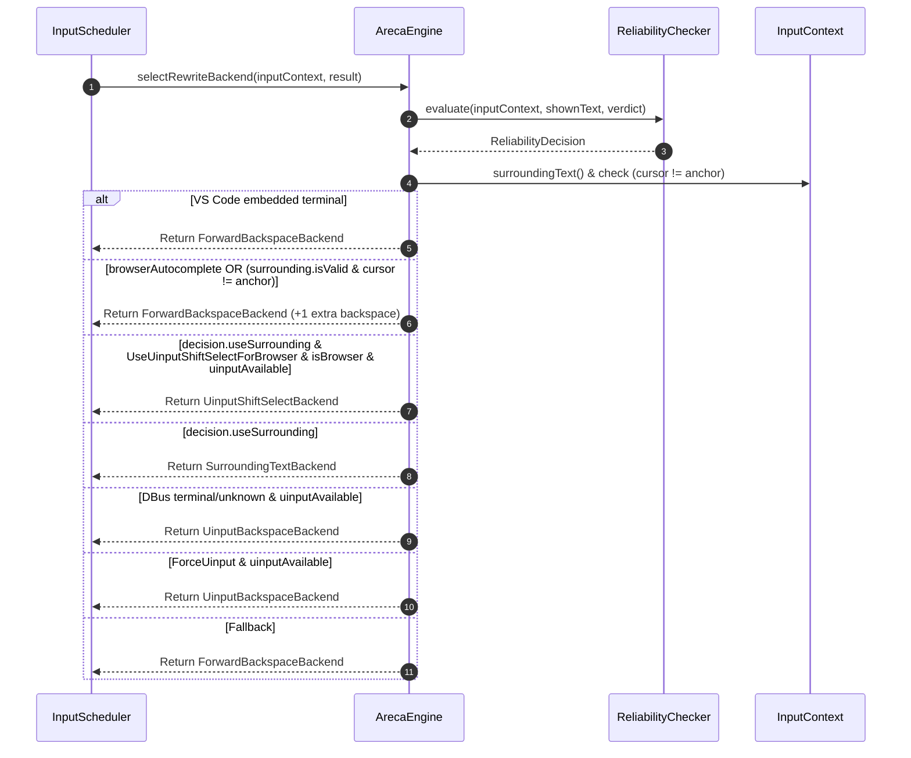
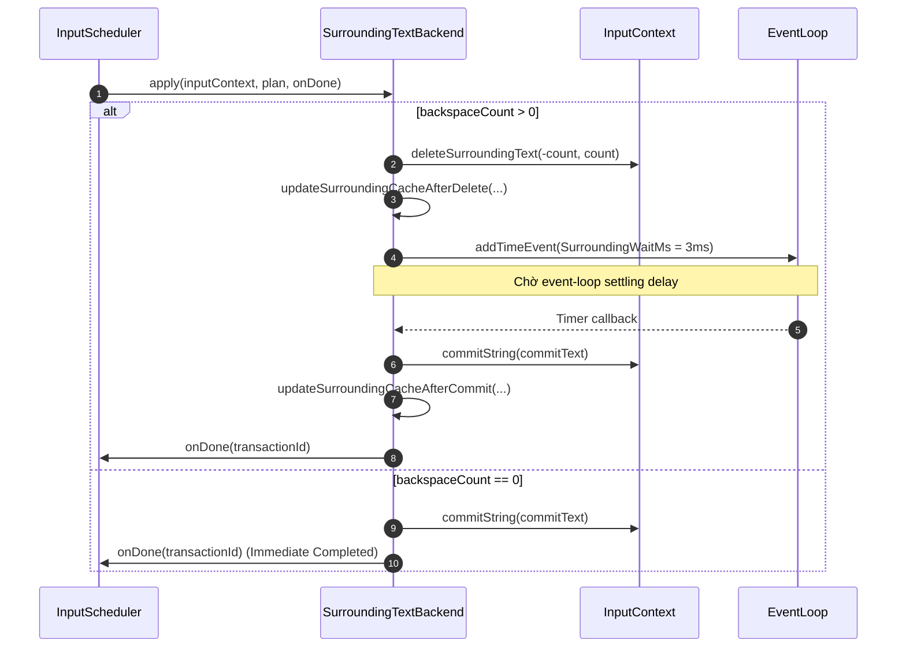
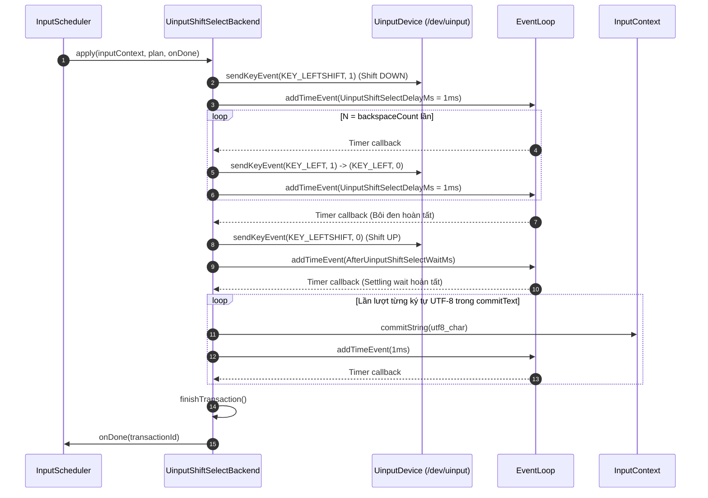
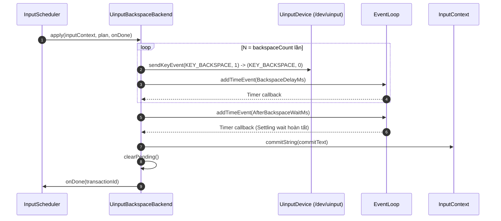
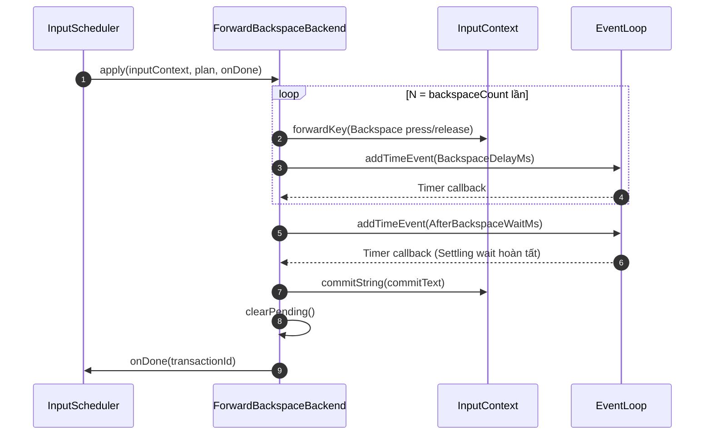
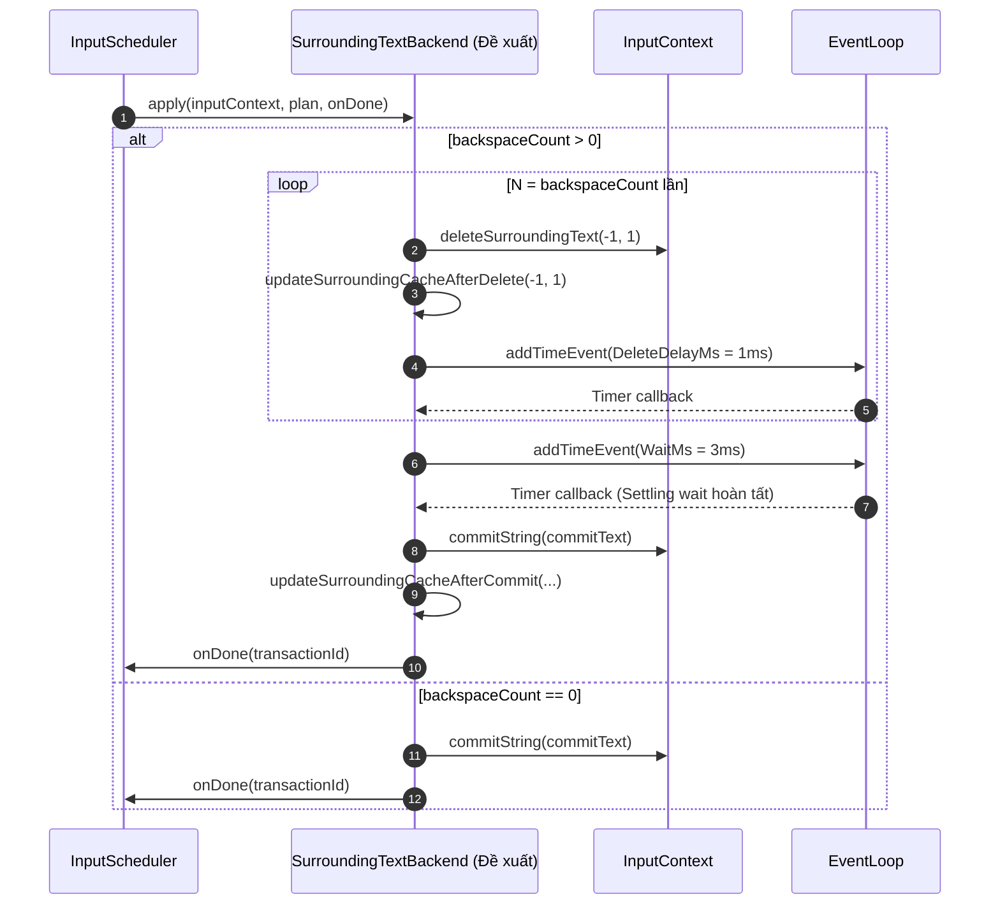

# Areca IME - Technical Architecture Specification

Tài liệu tả chi tiết kiến trúc kỹ thuật, luồng xử lý dữ liệu và sơ đồ tuần tự (Sequence Diagrams) của bộ gõ tiếng Việt **Areca IME** trên hệ điều hành Linux (Fcitx5 / Wayland).

> **Bản vẽ HTML xuất bản:** Xem giao diện HTML đẹp mắt và tương tác tại [website/architecture.html](../website/architecture.html).

---

## 1. Tổng quan hệ thống

Areca IME là bộ gõ tiếng Việt dành cho Linux dưới dạng mô-đun mở rộng (addon) của **Fcitx5**, được viết bằng **C++20**. Areca tích hợp trực tiếp thư viện core `bamboo-core` để xử lý quy tắc gõ tiếng Việt (Telex, VNI, VIQR, v.v.), đồng thời tự quản lý luồng sự kiện phím bất đồng bộ và cơ chế chỉnh sửa lại văn bản đã hiển thị.

```text
Fcitx5 Key Event
       ├──► Idle first key: Bamboo → unchanged → event chưa accept
       │ (Các text key còn lại: filterAndAccept)
       ▼
  KeyQueue (FIFO Queue)
       │ (Single-flight processing)
       ▼
 InputScheduler ──► BambooEngineAdapter ──► BambooResult
                                              │
                          deleteCount == 0 ───┼──► commitString
                                              │
                          deleteCount > 0  ───┘
                                              │
                          ReliabilityChecker & Policy
                                  │
    ┌─────────────────────────────┼─────────────────────────────┐
    ▼                             ▼                             ▼
SurroundingTextBackend  UinputShiftSelectBackend    ForwardBackspaceBackend
(deleteSurroundingText) (uinput Shift+Left bôi đen) (forwardKey Backspace × N)
```

---

## 2. Các thành phần chính (System Components)

| Thành phần | Trách nhiệm chính |
| :--- | :--- |
| `ArecaEngine` | Quản lý vòng đời Fcitx5 addon, dispatch sự kiện theo chế độ gõ (`PresentationMode`) và lưu cache Reliability Verdict cho từng InputContext. |
| `InputModeHandler` | Interface trừu tượng xử lý sự kiện phím cho các chế độ gõ. |
| `RewriteModeHandler` | Quản lý chế độ Rewrite (gõ trực tiếp); lọc phím và nạp phím vào `InputScheduler`. |
| `PreeditModeHandler` | Quản lý chế độ Preedit (gõ qua gạch chân composition); xử lý đồng bộ trực tiếp với Bamboo mà không qua scheduler hay backend rewrite. |
| `RedirectModeHandler` | Chế độ chuyển tiếp phím gốc (dùng cho ô nhập mật khẩu); bypass toàn bộ Bamboo engine và scheduler. |
| `KeyQueue` | Hàng đợi FIFO lưu trữ sự kiện phím gốc, Unicode codepoint, UTF-8 sequence và watch reference tới InputContext. |
| `MouseClickTracker` | Nhận cờ click qua pipe trên event loop, quản lý vòng đời helper. |
| `areca-mouse-monitor` | Process con dùng libinput/udev bắt nhấn chuột và tap touchpad. |
| `InputScheduler` | Bộ điều phối sự kiện đơn luồng (Single-flight Scheduler), quản lý ranh giới giao dịch (Transaction Barrier) và timer sau commit. |
| `BambooEngineAdapter` | Lớp cầu nối C++/Go gọi thư viện `bamboo-core`, biến đổi kết quả gõ thành `BambooResult` (bao gồm `deleteCount` và `commitText`). |
| `ReliabilityChecker` | Kiểm tra khả năng tương thích SurroundingText của ứng dụng ở lần gõ đầu tiên và quyết định chiến lược rewrite. |
| `RewriteBackend` | Interface trừu tượng định nghĩa phương thức thực thi một `RewritePlan`. |
| `SurroundingTextBackend` | Thực thi xóa văn bản qua API Fcitx `deleteSurroundingText()` và chèn chữ mới qua `commitString()`. |
| `UinputShiftSelectBackend` | Phát phím phần sống kernel `Shift + Left` qua `/dev/uinput` để bôi đen đoạn chữ cũ, sau đó commit từng ký tự mới cho ứng dụng trình duyệt web. |
| `UinputBackspaceBackend` | Phát phím phần sống kernel `KEY_BACKSPACE` qua `/dev/uinput` và dùng settling delay thích ứng theo timer drift cho terminal DBus và các ứng dụng không xác định. Terminal nhúng trong VS Code dùng `ForwardBackspaceBackend`. |
| `ForwardBackspaceBackend` | Phát phím Backspace tuần tự qua `InputContext::forwardKey()`, áp dụng settling delay thích ứng theo timer drift và commit chữ mới. |

---

## 3. Quy tắc Invariant cốt lõi

1. **Thứ tự FIFO bảo toàn**: Phím đi qua queue giữ thứ tự FIFO. Phím đầu chỉ được xử lý trực tiếp khi scheduler rảnh và không còn barrier bảo vệ.
2. **Xử lý đơn luồng (Single-flight)**: Chỉ một phím duy nhất được Bamboo xử lý tại một thời điểm. Phím mới đến trong lúc pipeline đang bận sẽ chờ ở `KeyQueue`.
3. **Ranh giới giao dịch (Transaction Barrier)**: Khi một Backend Rewrite đang chạy (xóa/bôi đen/commit), scheduler giữ trạng thái bận và không cho phím sau chen ngang.
4. **Không sleep trên Main Thread**: Mọi khoảng chờ (delay) giữa các phím bấm ảo và post-commit đều sử dụng timer bất đồng bộ trên EventLoop của Fcitx.

---

## 4. Chính sách lựa chọn Backend (`selectRewriteBackend`)

Khi Bamboo trả về kết quả yêu cầu xóa ký tự (`deleteCount > 0`), `ArecaEngine` lựa chọn Rewrite Backend theo thứ tự ưu tiên sau:



> [!IMPORTANT]
> **Cơ chế bảo vệ bôi đen (Selection Guard)**:
> Nếu phát hiện trong ô nhập liệu đang có văn bản bôi đen sẵn (`cursor != anchor`) hoặc có gợi ý Autocomplete của trình duyệt, hệ thống tự động loại bỏ `UinputShiftSelectBackend` và chuyển sang `ForwardBackspaceBackend` với `+1` phím Backspace bổ sung để xóa sạch vùng bôi đen một cách an toàn.

---

## 5. Chi tiết sơ đồ tuần tự (Sequence Diagrams) các Backend

### 5.1. `SurroundingTextBackend` Sequence Diagram



---

### 5.2. `UinputShiftSelectBackend` Sequence Diagram



---

### 5.3. `UinputBackspaceBackend` Sequence Diagram



---

### 5.4. `ForwardBackspaceBackend` Sequence Diagram



---

## 6. Đề xuất cải tiến tương lai (Future Architecture Extensions)

### Đề xuất SurroundingTextBackend xóa từng ký tự (Incremental Delete)

> [!NOTE]
> **Bối cảnh**: Hiện tại `SurroundingTextBackend` phát lệnh xóa gộp `deleteSurroundingText(-N, N)` trong 1 lần gọi RPC. Bộ máy Firefox Gecko hoặc một số Web Editor (Monaco, CodeMirror) xử lý câu lệnh xóa gộp `-N` ký tự không ổn định khi phía sau con trỏ đang có các ký tự đặc biệt (như dấu ngoặc `}}` hoặc thẻ HTML).



---

## 7. Bảng thông số cấu hình Timing (Advanced Timing Configuration)

| Tên tùy chọn trong Config | Ý nghĩa & Mô tả | Giá trị mặc định |
| :--- | :--- | :--- |
| `BackspaceDelayMs` | Delay giữa các phím Backspace ảo (ms) | `1 ms` |
| `AfterBackspaceWaitMs` | Thời gian chờ sau phím Backspace cuối (ms) | `10 ms` |
| `WaylandAfterBackspaceWaitMs` | Thời gian chờ sau phím Backspace cuối trên Wayland (ms) | `3 ms` |
| `XimAfterBackspaceWaitMs` | Thời gian chờ sau phím Backspace cuối trên XIM (ms) | `10 ms` |
| `Fcitx4AfterBackspaceWaitMs` | Thời gian chờ sau phím Backspace cuối trên Fcitx4 (ms) | `10 ms` |
| `DbusAfterBackspaceWaitMs` | Thời gian chờ sau phím Backspace cuối trên DBus (ms) | `10 ms` |
| `UinputShiftSelectDelayMs` | Delay giữa các phím uinput Shift+Left (ms) | `1 ms` |
| `AfterUinputShiftSelectWaitMs` | Thời gian chờ sau phím uinput Shift+Left cuối (ms) | `20 ms` |
| `WaylandAfterUinputShiftSelectWaitMs` | Thời gian chờ sau phím uinput Shift+Left cuối Wayland (ms) | `10 ms` |
| `XimAfterUinputShiftSelectWaitMs` | Thời gian chờ sau phím uinput Shift+Left cuối XIM (ms) | `20 ms` |
| `Fcitx4AfterUinputShiftSelectWaitMs` | Thời gian chờ sau phím uinput Shift+Left cuối Fcitx4 (ms) | `20 ms` |
| `DbusAfterUinputShiftSelectWaitMs` | Thời gian chờ sau phím uinput Shift+Left cuối DBus (ms) | `20 ms` |
| `SurroundingWaitMs` | Thời gian chờ sau xóa surrounding text | `3 ms` |
| `PostCommitDelayMs` | Delay bảo vệ sau mỗi lượt commit (ms) | `20 ms` |
| `PreciseTiming` | Sử dụng timer độ chính xác cao (1µs) | `True` |

### Bật/tắt tính năng tương thích

Hai tùy chọn trong **Cấu hình nâng cao** (`conf/areca-advanced.conf`) mặc định tắt:

| Khóa | Nhãn giao diện | Khi tắt |
| --- | --- | --- |
| `EnableMouseTracking` | Theo dõi click chuột để reset bộ gõ | Hủy tracker, watcher, pipe và process helper; xóa click đang chờ. |
| `ForwardFirstCharacter` | Chuyển tiếp phím đầu khi bộ gõ rảnh | Bỏ qua `handleIdleKey()`, text key dùng luồng accept/enqueue cũ. |

Thay đổi qua giao diện cấu hình có hiệu lực ngay. Nếu sửa file bằng tay, cần
reload cấu hình Fcitx. Bật lại mouse tracking tạo helper mới, không giữ click cũ.
Tắt cả hai bằng:

```ini
EnableMouseTracking=False
ForwardFirstCharacter=False
```

Mouse tracking dùng process riêng; tắt sẽ dừng hẳn process đó. Chuyển tiếp phím
đầu không tạo thread/process riêng. Chưa có benchmark so sánh hiệu năng hai chế
độ; các tùy chọn này cho phép kiểm tra trên ứng dụng và môi trường thực tế.

## Phím đầu khi Rewrite đang rảnh

Một số editor web cần nhận sự kiện phím qua frontend để mở chế độ soạn thảo.
Khi `ForwardFirstCharacter=True`, trước `filterAndAccept()`, `RewriteModeHandler` thử
`InputScheduler::handleIdleKey()` khi không chờ Backspace release và phím không
bị đổi bởi tự viết hoa. Scheduler chỉ nhận nhánh này khi Bamboo không giữ text,
không processing, không rewrite pending, queue rỗng, không stalled và đã qua
khoảng bảo vệ reset sau commit (hiện là 20 ms).

Bamboo vẫn xử lý phím đúng một lần. Nếu `deleteCount == 0`, `commitText` bằng
UTF-8 đầu vào và không mở rộng macro, addon để event chưa filter/accept cho
frontend xử lý. Trạng thái Bamboo được giữ để phím sau vẫn ghép dấu, ví dụ
`a` rồi `s` thành `á`. Nhánh này không gọi `commitString()`, không phát cặp
`forwardKey()` giả, không tự cập nhật surrounding cache và không tạo barrier
sau commit vì addon chưa thực hiện commit.

`KeyEvent::forward()` trong API Fcitx đang dùng là getter; việc để event chưa
filter/accept mới là điều cho phép phím đi tiếp. Cách frontend giao event đến
trang web vẫn cần kiểm tra trên từng môi trường thực tế.

Nếu Bamboo đổi đầu ra, scheduler accept event và áp dụng ngay kết quả đã tính,
không enqueue lại để tránh xử lý cùng phím hai lần. Nếu chưa đủ điều kiện,
`handleIdleKey()` trả false mà không sửa engine/event; caller dùng FIFO như cũ.
Phím bị tự viết hoa cũng dùng luồng commit để giữ ký tự đã biến đổi.

## Theo dõi click và reset composition

`WindowFocusTracker` là thread đọc AT-SPI trong Fcitx. `MouseClickTracker`
quản lý process con riêng `areca-mouse-monitor`; helper dùng libinput/udev trên
`XDG_SEAT` (mặc định `seat0`) và cùng quyền user với Fcitx. Không cần socket
server hoặc thread nhận chuột trong addon.

```text
libinput/udev → areca-mouse-monitor → stdout pipe riêng (R/C)
             → MouseClickTracker trên event loop Fcitx → pending click
             → ArecaEngine::keyEvent → kiểm tra scheduler → reset handler
```

- `R` báo context libinput đã khởi tạo, không đảm bảo có thiết bị đọc được.
- `C` báo nút chuột được nhấn, không phân biệt nút trái/phải/giữa. Helper bật
  tap-to-click trong context libinput riêng; di chuyển, cuộn và nhả nút không
  gửi reset. udev hỗ trợ thiết bị được cắm thêm sau khi helper chạy.
- Pipe nonblocking tránh chặn event loop/dispatch; nhiều click gộp thành một
  cờ reset. stderr dành cho log, không lẫn vào protocol stdout.
- Callback pipe chỉ đánh dấu. Trước phím nhấn tiếp theo, addon đọc thêm pipe để
  lấy click đã đến nhưng callback chưa chạy. Nếu scheduler đang bảo vệ rewrite,
  cờ vẫn được giữ cho phím sau; nếu được phép thì reset handler đang active,
  xử lý cache verdict theo lifecycle và xóa cờ. Redirect không có composition
  để reset. Đây không phải reset tức thời ngay khi click.
- Activation thử khởi động lại helper đã mất kết nối và bỏ click cũ đã nhận.
  Khi pipe đóng, watcher bị tắt; pending click đã nhận vẫn được giữ. Hủy tracker
  sẽ đóng pipe, kết thúc và thu hồi process con bằng `waitpid()`. Helper cũng
  theo dõi pipe để thoát khi Fcitx mất kết nối, kể cả không có click mới.

Helper được cài vào `CMAKE_INSTALL_LIBEXECDIR`; addon nhúng đường dẫn tuyệt đối
ứng với `CMAKE_INSTALL_PREFIX`. Build cần libinput và libudev. Rule
`70-areca-pointer.rules` cấp `uaccess` cho chuột/touchpad của phiên local đang
active, trước `73-seat-late.rules`. Không có ACL/quyền đọc thiết bị thì tính năng
click không hoạt động; nhập liệu Fcitx bình thường vẫn hoạt động. Xem
[Debug mouse tracker](DEBUGGING.md#mouse-tracker) để kiểm tra cài đặt và log.
