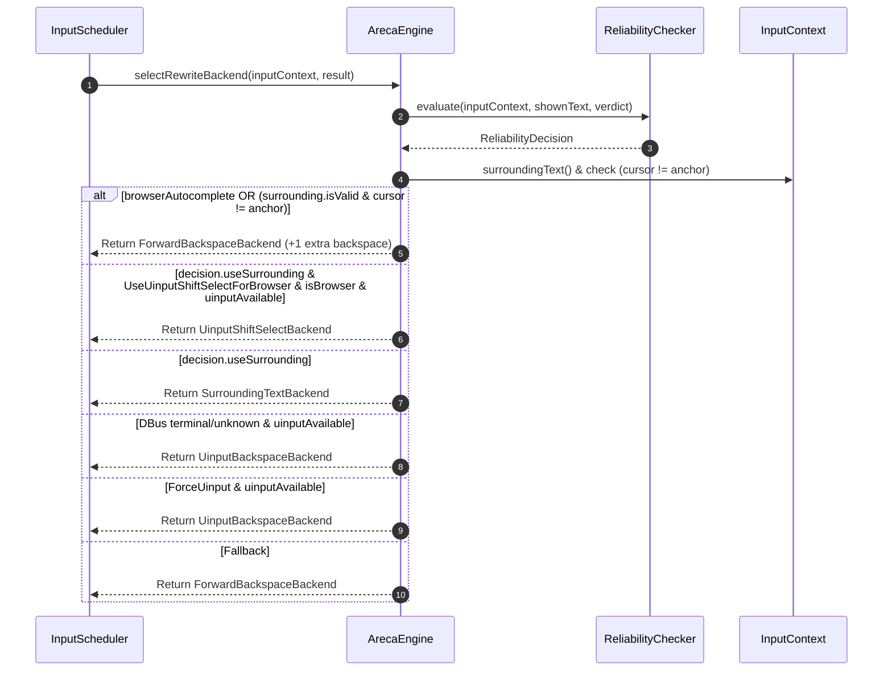
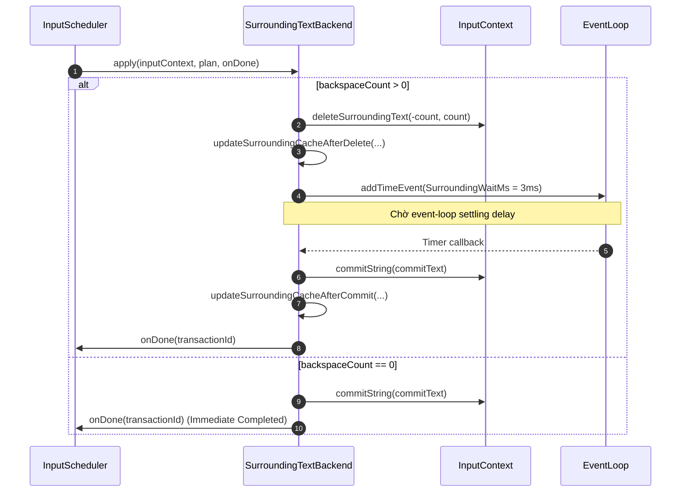
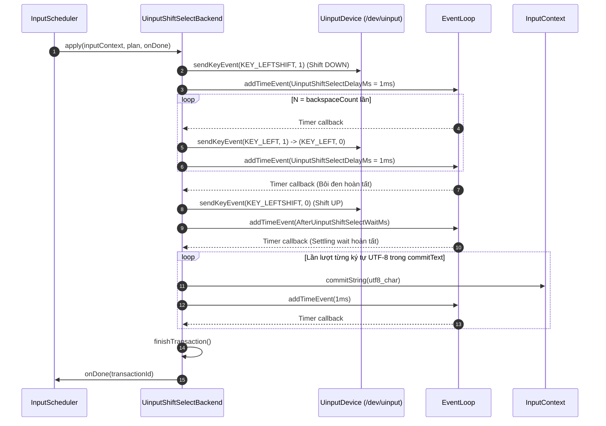
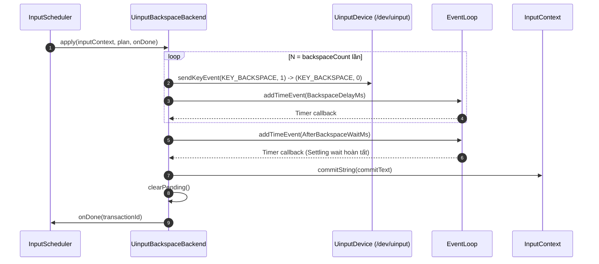
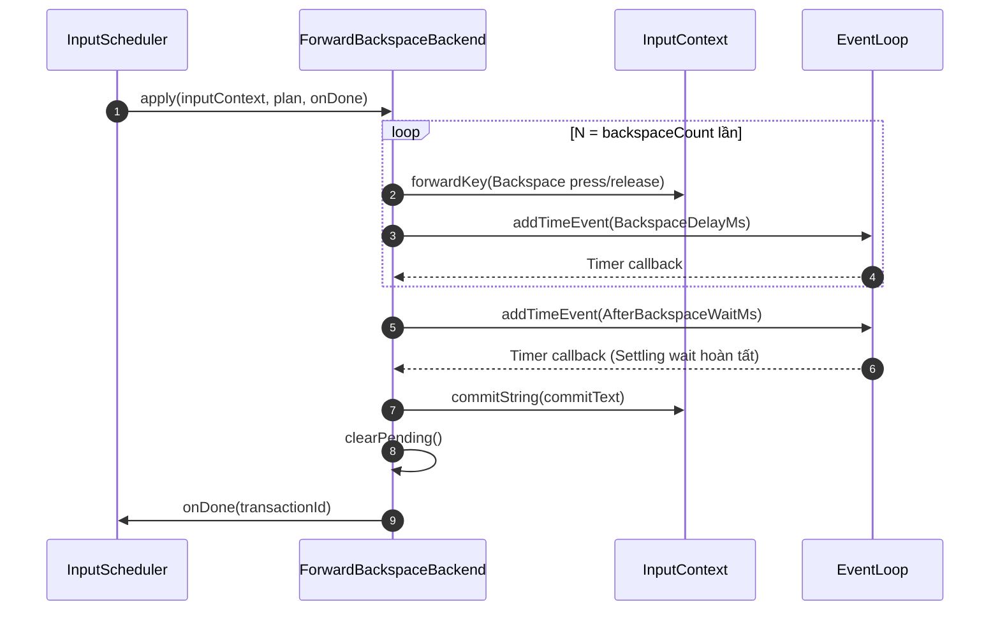
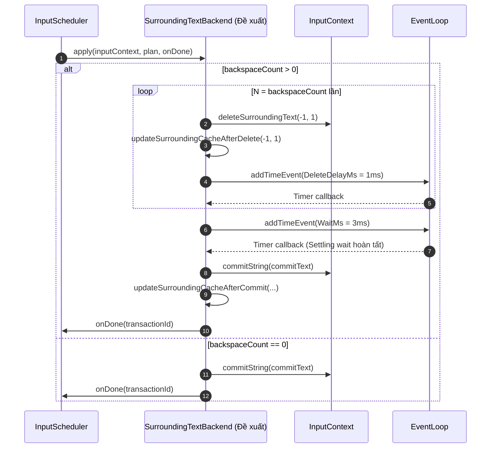

# Areca IME - Technical Architecture Specification

Tài liệu tả chi tiết kiến trúc kỹ thuật, luồng xử lý dữ liệu và sơ đồ tuần tự (Sequence Diagrams) của bộ gõ tiếng Việt **Areca IME** trên hệ điều hành Linux (Fcitx5 / Wayland).

> **Bản vẽ HTML xuất bản:** Xem giao diện HTML đẹp mắt và tương tác tại [website/architecture.html](../website/architecture.html).

---

## 1. Tổng quan hệ thống

Areca IME là bộ gõ tiếng Việt dành cho Linux dưới dạng mô-đun mở rộng (addon) của **Fcitx5**, được viết bằng **C++20**. Areca tích hợp trực tiếp thư viện core `bamboo-core` để xử lý quy tắc gõ tiếng Việt (Telex, VNI, VIQR, v.v.), đồng thời tự quản lý luồng sự kiện phím bất đồng bộ và cơ chế chỉnh sửa lại văn bản đã hiển thị.

```text
Fcitx5 Key Event
       │ (Filter Text Key)
       ▼
  KeyQueue (FIFO Queue)
       │ (Single-flight processing)
       ▼
 InputScheduler ──► BambooEngineAdapter ──► BambooResult
                                              │
                          deleteCount == 0 ───┼──► commitString
                                              │
                          deleteCount > 0  ───┘
                                              │
                          ReliabilityChecker & Policy
                                  │
    ┌─────────────────────────────┼─────────────────────────────┐
    ▼                             ▼                             ▼
SurroundingTextBackend  UinputShiftSelectBackend    ForwardBackspaceBackend
(deleteSurroundingText) (uinput Shift+Left bôi đen) (forwardKey Backspace × N)
```

---

## 2. Các thành phần chính (System Components)

| Thành phần | Trách nhiệm chính |
| :--- | :--- |
| `ArecaEngine` | Quản lý vòng đời Fcitx5 addon, dispatch sự kiện theo chế độ gõ (`PresentationMode`) và lưu cache Reliability Verdict cho từng InputContext. |
| `InputModeHandler` | Interface trừu tượng xử lý sự kiện phím cho các chế độ gõ. |
| `RewriteModeHandler` | Quản lý chế độ Rewrite (gõ trực tiếp); lọc phím và nạp phím vào `InputScheduler`. |
| `PreeditModeHandler` | Quản lý chế độ Preedit (gõ qua gạch chân composition); xử lý đồng bộ trực tiếp với Bamboo mà không qua scheduler hay backend rewrite. |
| `RedirectModeHandler` | Chế độ chuyển tiếp phím gốc (dùng cho ô nhập mật khẩu); bypass toàn bộ Bamboo engine và scheduler. |
| `KeyQueue` | Hàng đợi FIFO lưu trữ sự kiện phím gốc, Unicode codepoint, UTF-8 sequence và watch reference tới InputContext. |
| `InputScheduler` | Bộ điều phối sự kiện đơn luồng (Single-flight Scheduler), quản lý ranh giới giao dịch (Transaction Barrier) và timer sau commit. |
| `BambooEngineAdapter` | Lớp cầu nối C++/Go gọi thư viện `bamboo-core`, biến đổi kết quả gõ thành `BambooResult` (bao gồm `deleteCount` và `commitText`). |
| `ReliabilityChecker` | Kiểm tra khả năng tương thích SurroundingText của ứng dụng ở lần gõ đầu tiên và quyết định chiến lược rewrite. |
| `RewriteBackend` | Interface trừu tượng định nghĩa phương thức thực thi một `RewritePlan`. |
| `SurroundingTextBackend` | Thực thi xóa văn bản qua API Fcitx `deleteSurroundingText()` và chèn chữ mới qua `commitString()`. |
| `UinputShiftSelectBackend` | Phát phím phần sống kernel `Shift + Left` qua `/dev/uinput` để bôi đen đoạn chữ cũ, sau đó commit từng ký tự mới cho ứng dụng trình duyệt web. |
| `UinputBackspaceBackend` | Phát phím phần sống kernel `KEY_BACKSPACE` qua `/dev/uinput` cho terminal DBus và các ứng dụng không xác định. |
| `ForwardBackspaceBackend` | Phát phím Backspace tuần tự qua `InputContext::forwardKey()`, áp dụng delay thiết lập và commit chữ mới. |

---

## 3. Quy tắc Invariant cốt lõi

1. **Thứ tự FIFO bảo toàn**: Sự kiện phím đầu vào luôn được xếp hàng và xử lý đúng thứ tự thời gian.
2. **Xử lý đơn luồng (Single-flight)**: Chỉ một phím duy nhất được Bamboo xử lý tại một thời điểm. Phím mới đến trong lúc pipeline đang bận sẽ chờ ở `KeyQueue`.
3. **Ranh giới giao dịch (Transaction Barrier)**: Khi một Backend Rewrite đang chạy (xóa/bôi đen/commit), scheduler giữ trạng thái bận và không cho phím sau chen ngang.
4. **Không sleep trên Main Thread**: Mọi khoảng chờ (delay) giữa các phím bấm ảo và post-commit đều sử dụng timer bất đồng bộ trên EventLoop của Fcitx.

---

## 4. Chính sách lựa chọn Backend (`selectRewriteBackend`)

Khi Bamboo trả về kết quả yêu cầu xóa ký tự (`deleteCount > 0`), `ArecaEngine` lựa chọn Rewrite Backend theo thứ tự ưu tiên sau:



> [!IMPORTANT]
> **Cơ chế bảo vệ bôi đen (Selection Guard)**:
> Nếu phát hiện trong ô nhập liệu đang có văn bản bôi đen sẵn (`cursor != anchor`) hoặc có gợi ý Autocomplete của trình duyệt, hệ thống tự động loại bỏ `UinputShiftSelectBackend` và chuyển sang `ForwardBackspaceBackend` với `+1` phím Backspace bổ sung để xóa sạch vùng bôi đen một cách an toàn.

---

## 5. Chi tiết sơ đồ tuần tự (Sequence Diagrams) các Backend

### 5.1. `SurroundingTextBackend` Sequence Diagram



---

### 5.2. `UinputShiftSelectBackend` Sequence Diagram



---

### 5.3. `UinputBackspaceBackend` Sequence Diagram



---

### 5.4. `ForwardBackspaceBackend` Sequence Diagram



---

## 6. Đề xuất cải tiến tương lai (Future Architecture Extensions)

### Đề xuất SurroundingTextBackend xóa từng ký tự (Incremental Delete)

> [!NOTE]
> **Bối cảnh**: Hiện tại `SurroundingTextBackend` phát lệnh xóa gộp `deleteSurroundingText(-N, N)` trong 1 lần gọi RPC. Bộ máy Firefox Gecko hoặc một số Web Editor (Monaco, CodeMirror) xử lý câu lệnh xóa gộp `-N` ký tự không ổn định khi phía sau con trỏ đang có các ký tự đặc biệt (như dấu ngoặc `}}` hoặc thẻ HTML).



---

## 7. Bảng thông số cấu hình Timing (Advanced Timing Configuration)

| Tên tùy chọn trong Config | Ý nghĩa & Mô tả | Giá trị mặc định |
| :--- | :--- | :--- |
| `BackspaceDelayMs` | Delay giữa các phím Backspace ảo (ms) | `1 ms` |
| `AfterBackspaceWaitMs` | Thời gian chờ sau phím Backspace cuối (ms) | `10 ms` |
| `WaylandAfterBackspaceWaitMs` | Thời gian chờ sau phím Backspace cuối trên Wayland (ms) | `3 ms` |
| `XimAfterBackspaceWaitMs` | Thời gian chờ sau phím Backspace cuối trên XIM (ms) | `10 ms` |
| `Fcitx4AfterBackspaceWaitMs` | Thời gian chờ sau phím Backspace cuối trên Fcitx4 (ms) | `10 ms` |
| `DbusAfterBackspaceWaitMs` | Thời gian chờ sau phím Backspace cuối trên DBus (ms) | `20 ms` |
| `UinputShiftSelectDelayMs` | Delay giữa các phím uinput Shift+Left (ms) | `1 ms` |
| `AfterUinputShiftSelectWaitMs` | Thời gian chờ sau phím uinput Shift+Left cuối (ms) | `20 ms` |
| `WaylandAfterUinputShiftSelectWaitMs` | Thời gian chờ sau phím uinput Shift+Left cuối Wayland (ms) | `10 ms` |
| `XimAfterUinputShiftSelectWaitMs` | Thời gian chờ sau phím uinput Shift+Left cuối XIM (ms) | `20 ms` |
| `Fcitx4AfterUinputShiftSelectWaitMs` | Thời gian chờ sau phím uinput Shift+Left cuối Fcitx4 (ms) | `20 ms` |
| `DbusAfterUinputShiftSelectWaitMs` | Thời gian chờ sau phím uinput Shift+Left cuối DBus (ms) | `20 ms` |
| `SurroundingWaitMs` | Thời gian chờ sau xóa surrounding text | `3 ms` |
| `PostCommitDelayMs` | Delay bảo vệ sau mỗi lượt commit (ms) | `20 ms` |
| `PreciseTiming` | Sử dụng timer độ chính xác cao (1µs) | `True` |
